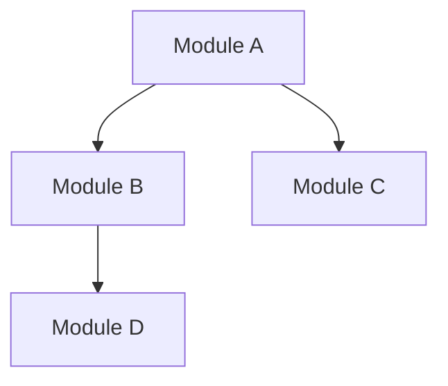

# Sprint Selection Algorithm Design Document

## 技术栈声明

本文档设计的算法将使用 **TypeScript** 实现，使用 **pnpm** 作为包管理工具。

---

## 格式选型说明

| 输出文件 | 格式 | 决策依据 |
|---------|------|---------|
| `proposal.md` | Markdown | 叙述性、人类阅读、需要段落 |
| `design.md` | Markdown | 叙述性 + Mermaid 图表 |
| `wbs.yaml` | YAML | 程序解析、纯结构化任务清单 |
| `tasks.yaml` | YAML | 程序解析、atom_tasks 清单 |
| `reviews.md` | Markdown | Review 评语、人类阅读 |
| `brain.json` | JSON | 程序高频读写、持久化状态 |
| `pmb.yaml` | YAML | 人类编辑 lessons + 程序读取 |

> **待确认**: `proposal.md` / `design.md` / `reviews.md` 的具体章节格式需在阅读 OpenSpec 溓码后校准。当前为初步设计。

---

## OMT 架构上下文回顾

```
.omt/tspecs/tspec_<timestamp>/
├── proposal.md              # TSpec 顶层规范 (Markdown)
├── design.md                # 架构设计 (Markdown + Mermaid)
├── milestones.md            # Milestone 定义 (Markdown)
├── reviews.md               # TSpec Review 结果 (Markdown)
│
└── mspecs/mspec_<timestamp>/
    ├── proposal.md          # MSpec 描述 (Markdown)
    ├── design.md            # 模块设计 (Markdown)
    ├── wbs.yaml             # WBS 任务清单 (YAML) ← 程序解析
    ├── reviews.md           # MSpec Review (Markdown)
    │
    └── sprints/sprint_<num>/
        ├── tasks.yaml       # atom_tasks (YAML) ← 程序解析
        └── review.md        # Sprint Review (Markdown)
```

---

## 1. TypeScript 类型定义

### 1.1 WBS YAML Schema

```yaml
# .omt/tspecs/.../mspecs/.../wbs.yaml

version: "1.0"
mspecId: "mspec_m1"
totalTasks: 30
remainingTasks: 25  # 执行过程中动态更新

tasks:
  - id: "auth-001"
    description: "Implement JWT token generation"
    complexity: 6
    assigneeRole: "backend-dev"
    blockedBy: []
    riskLevel: "HIGH"
    estimatedHours: 4
    status: "pending"  # pending | in_progress | completed | failed | deferred
    
  - id: "auth-002"
    description: "Create refresh token logic"
    complexity: 4
    assigneeRole: "backend-dev"
    blockedBy: ["auth-001"]
    riskLevel: "MEDIUM"
    estimatedHours: 3
    status: "pending"
```

### 1.2 TypeScript 类型

```typescript
// src/types/wbs.ts

export type RiskLevel = 'LOW' | 'MEDIUM' | 'HIGH' | 'CRITICAL';
export type TaskStatus = 'pending' | 'in_progress' | 'completed' | 'failed' | 'deferred';

export interface WBS {
  version: string;
  mspecId: string;
  totalTasks: number;
  remainingTasks: number;
  tasks: AtomTask[];
}

export interface AtomTask {
  id: string;
  description: string;
  complexity: number;
  assigneeRole: string;
  blockedBy: string[];
  riskLevel: RiskLevel;
  estimatedHours: number;
  status: TaskStatus;
}
```

---

## 2. Sprint tasks.yaml 格式

```yaml
# .omt/tspecs/.../sprints/sprint_001/tasks.yaml

sprintId: "sprint_001"
milestoneId: "mspec_m1"
createdAt: "2026-04-30T10:00:00Z"
selectionReason: "Critical path + dependency ready"

tasks:
  - taskId: "auth-001"
    priority: 1
    score: 310  # 选择算法计算的权重
    parallelGroup: "A"  # 可并行组
    
  - taskId: "ui-001"
    priority: 2
    score: 100
    parallelGroup: "A"
    
  - taskId: "config-001"
    priority: 3
    score: 215
    parallelGroup: "B"

parallelismScore: 5
estimatedTotalHours: 28
```

---

## 3. 选择标准权重设计

### 3.1 TypeScript 常量

```typescript
// src/constants/weights.ts

export const SELECTION_WEIGHTS = {
  W_CRITICAL_PATH: 100,
  W_DEPENDENCY_READY: 80,
  W_DEFERRED_BOOST: 70,
  W_HIGH_RISK: 60,
  W_HIGH_COMPLEXITY: 50,
  W_HOTSPOT_RELATED: 40,
  W_BALANCE_LOAD: 30,
} as const;
```

### 3.2 权重计算函数

```typescript
// src/services/sprint-selection/score-calculator.ts

export function computeTaskScore(
  task: AtomTask,
  criticalPath: Set<string>,
  pmb: PMB,
  graspOutput: GraspDetectChangesOutput
): number {
  
  const CP = criticalPath.has(task.id) ? 1.0 : 0.0;
  const DR = 1.0;  // 依赖已在 filter 步骤保证
  const deferredCount = countDeferrals(task.id, pmb);
  const DF = Math.min(deferredCount + 1, 2);
  
  const riskMap: Record<RiskLevel, number> = {
    'LOW': 0.0, 'MEDIUM': 0.5, 'HIGH': 1.0, 'CRITICAL': 1.0
  };
  const HR = riskMap[task.riskLevel];
  
  const HC = task.complexity / 10.0;
  const HS = isHotspotRelated(task, graspOutput) ? 1.0 : 0.0;
  const BL = computeBalanceFactor(task.assigneeRole);
  
  return (
    CP * SELECTION_WEIGHTS.W_CRITICAL_PATH +
    DR * SELECTION_WEIGHTS.W_DEPENDENCY_READY +
    DF * SELECTION_WEIGHTS.W_DEFERRED_BOOST +
    HR * SELECTION_WEIGHTS.W_HIGH_RISK +
    HC * SELECTION_WEIGHTS.W_HIGH_COMPLEXITY +
    HS * SELECTION_WEIGHTS.W_HOTSPOT_RELATED +
    BL * SELECTION_WEIGHTS.W_BALANCE_LOAD
  );
}
```

---

## 4. 算法核心实现

### 4.1 Sprint 选择器

```typescript
// src/services/sprint-selection/sprint-selector.ts

export interface SprintSelectionResult {
  tasks: AtomTask[];
  parallelismScore: number;
  estimatedHours: number;
}

export function selectSprintTasks(
  wbs: WBS,
  dag: DependencyGraph,
  pmb: PMB,
  graspOutput: GraspDetectChangesOutput
): SprintSelectionResult {
  
  const criticalPath = computeCriticalPath(dag);
  const completedTaskIds = new Set(
    wbs.tasks.filter(t => t.status === 'completed').map(t => t.id)
  );
  
  const executableTasks = wbs.tasks.filter(task => 
    task.status === 'pending' &&
    task.blockedBy.every(dep => completedTaskIds.has(dep))
  );
  
  if (executableTasks.length === 0) {
    return handleEmptyExecutablePool(wbs, dag, pmb);
  }
  
  const scoredTasks = executableTasks.map(task => ({
    task,
    score: computeTaskScore(task, criticalPath, pmb, graspOutput)
  }));
  
  scoredTasks.sort((a, b) => b.score - a.score);
  
  const selected = selectWithParallelismConstraint(scoredTasks, dag, {
    maxTasks: 10,
    minParallelism: 3
  });
  
  return {
    tasks: selected,
    parallelismScore: computeParallelism(selected, dag),
    estimatedHours: selected.reduce((sum, t) => sum + t.estimatedHours, 0)
  };
}
```

---

## 5. 文件目录结构

```
src/
├── types/
│   ├── wbs.ts
│   ├── atom-task.ts
│   └── sprint-tasks.ts
│
├── constants/
│   └── weights.ts
│
├── services/
│   └── sprint-selection/
│       ├── sprint-selector.ts
│       ├── critical-path.ts
│       ├── dependency-filter.ts
│       ├── score-calculator.ts
│       ├── parallelism-constraint.ts
│       └── boundary-handler.ts
│
└── index.ts

.omt/
├── tspecs/
│   └── tspec_20260430_001/
│       ├── proposal.md           # Markdown ✓ 叙述性
│       ├── design.md             # Markdown ✓ 设计决策
│       ├── milestones.md         # Markdown ✓ Milestone列表
│       ├── reviews.md            # Markdown ✓ Review评语
│       │
│       └── mspecs/
│           └── mspec_m1/
│               ├── proposal.md   # Markdown ✓
│               ├── design.md     # Markdown ✓
│               ├── wbs.yaml      # YAML ✓ 程序解析
│               ├── reviews.md    # Markdown ✓
│               └── sprints/
│                   └── sprint_001/
│                       ├── tasks.yaml    # YAML ✓ 程序解析
│                       └── review.md     # Markdown ✓
│                   └── sprint_002/
│                       └── ...
│
├── memory/
│   └── pmb.yaml                 # YAML ✓ 人类+程序
│
├── brain.json                   # JSON ✓ 高频读写
│
└── logs/
    └── sprint-selection.log     # JSON 日志
```

---

## 6. Markdown 初步格式设计

> **待确认**: 需阅读 OpenSpec 源码后校准具体格式

### 6.1 proposal.md 初步格式

```markdown
# MSpec Proposal: <milestone-name>

## Overview

<一句话描述当前 Milestone 的目标>

## Scope

### In Scope
- <模块/功能列表>

### Out of Scope
- <不包含的内容>

## Dependencies

### Blocked By
- <前置 Milestone 或依赖>

### Blocks
- <后续 Milestone>

## Risks

| Risk | Level | Mitigation |
|------|-------|------------|
| <风险描述> | HIGH/MEDIUM/LOW | <缓解措施> |

## Target

- **Health Grade**: A/B/C
- **Test Coverage**: 80%
- **Security Issues**: 0 CRITICAL/HIGH

## Estimated Effort

- **Total Tasks**: 30
- **Estimated Hours**: 120h
- **Sprints**: 3-4
```

### 6.2 design.md 初步格式

```markdown
# MSpec Design: <milestone-name>

## Architecture

### Module Structure



### Layer Definition

| Layer | Modules | Responsibility |
|-------|---------|---------------|
| Services | auth, api | 业务逻辑 |
| Utils | logger, date | 工具函数 |

## Interface Design

### API Endpoints

| Endpoint | Method | Description |
|----------|--------|-------------|
| /auth/login | POST | 用户登录 |

### Internal Interfaces

```typescript
interface AuthService {
  login(provider: string): Token;
  validate(token: string): boolean;
}
```

## Key Decisions

1. **选择 OAuth2 而非 JWT**
   - 原因: 用户要求 Google 登录支持
   
2. **使用 Redis 存储 Session**
   - 原因: 分布式场景需要共享状态
```

### 6.3 reviews.md 初步格式

```markdown
# MSpec Review: <milestone-name>

## Review Summary

- **Status**: COMPLETE | PARTIAL_COMPLETE | FAILED
- **Review Date**: <timestamp>
- **Reviewer**: <agent-role>

## Completion Status

| Metric | Target | Actual | Status |
|--------|--------|--------|--------|
| Tasks | 30 | 28 | ✓ |
| Health Grade | B | C | ⚠️ |
| Test Coverage | 80% | 75% | ⚠️ |

## Quality Assessment

### Strengths
- <做得好的地方>

### Issues
| Issue | Severity | Recommendation |
|-------|----------|---------------|
| <问题描述> | HIGH/MEDIUM/LOW | <建议> |

## Lessons Learned

1. <经验教训>

## Next Milestone Recommendations

- <对下一个 MSpec 的建议>
```

---

## 7. 与 OpenSpec 格式的差异说明

| OMT 输出 | OpenSpec 对应 | 差异原因 |
|---------|--------------|---------|
| `wbs.yaml` | `tasks.md` | OMT 需要程序解析 WBS 驱动 Sprint Selection |
| `tasks.yaml` | OpenSpec 无 | OMT Sprint atom_tasks 需要程序分配 |
| `brain.json` | OpenSpec 无 | OMT 项目级持久化，高频读写 |
| `pmb.yaml` | OpenSpec 无 | OMT 共享记忆，人类+程序混合编辑 |

OpenSpec 全部 Markdown 的原因：它是 AI Agent 与人类协作的沟通工具，强调人类阅读。

OMT 引入 YAML/JSON 的原因：需要程序解析驱动 Sprint Selection Algorithm 和状态持久化。